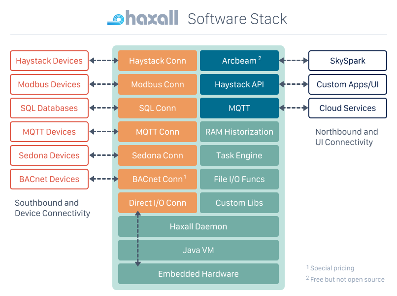

<!--
title:      Architecture
author:     Brian Frank
created:    31 Aug 2021
copyright:  Copyright (c) 2021, SkyFoundry LLC
license:    Licensed under the Academic Free License version 3.0
-->

# Overview
Haxall is an open source software framework for the [Internet of Things](http://en.wikipedia.org/wiki/Internet_of_Things).
It includes an extensive toolkit for working with [Project Haystack](https://project-haystack.org)
data. Use it right out of the box as a flexible IoT data gateway which runs
at the edge. Haxall is written in [Fantom](https://fantom.org) with runtime
support for both the Java VM and JavaScript environments.

# Concepts
Haxall is composed of the following key concepts and subsystems:

  - [Ontology](ph.doc::Ontology): we standardize the modeling of the
    built environment using Project Haystack
  - [Folio]: database optimized for the real-time nature of IoT data
  - [Namespace]: xeto lib namespace of specs determine extensions, funcs, data modeling
  - [Axon]: functional scripting language for onboarding and transforming IoT data
  - [HTTP API](ph.doc::HttpApi): all functionality is accessible over the Haystack HTTP API
  - [Connectors](Conns): framework for connectivity to IoT devices and protocols
  - [Exts]: pluggable modules for functionality
  - [Runtime]: top-level API for working with a project
  - [Daemon](Runtime#daemon): complete runtime server with batteries included

# Libs
Functionality is packaged into *libs* that are reusable modules you can
enable/disable at runtime.  The most important libraries include:
  - [axon](axon::index): core functions for Haystack data values
  - [hx](hx::index): core runtime functions
  - [math](hx.math::index): mathematical functions
  - [io](hx.io::index): functions to read/write data in a variety of formats
  - [conn](hx.conn::index): work with connectors
  - [task](hx.task::index): schedule background work using actor framework
  - [point](hx.point::index): support for writable points and history collection

# Software Stack
The following diagram illustrates how the system fits together:

# SkySpark
Haxall is developed by [SkyFoundry](https://skyfoundry.com).  It the
foundational layer of our commercial product [SkySpark](https://skyfoundry.com/product)
that we have opened sourced to the community.  As such, the documentation
contains many notes related to the features which work differently or are only
available in SkySpark.

Extensions developed for Haxall will run seamlessly in SkySpark.  For example
if you develop a connector or Axon function library as a Haxall [ext](Exts),
then you can drop that same code into a SkySpark runtime and it will be available
as a normal extension.

Haxall databases are also binary compatible with SkySpark.  So you can open
and run a Haxall database in SkySpark and vice versa.  Note that not all
extensions will run in Haxall - only the core open source libs such as the
ones [listed above](#libs).
